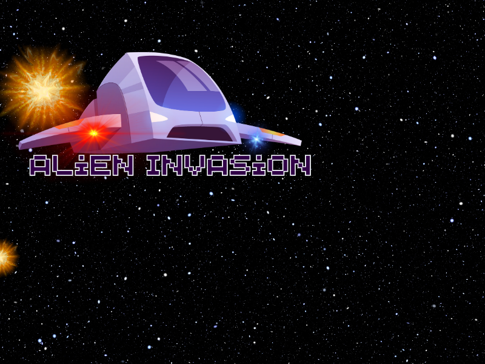
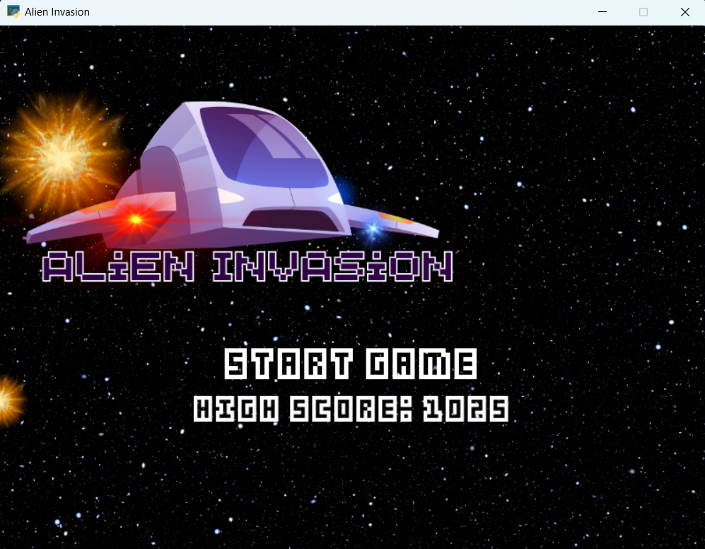
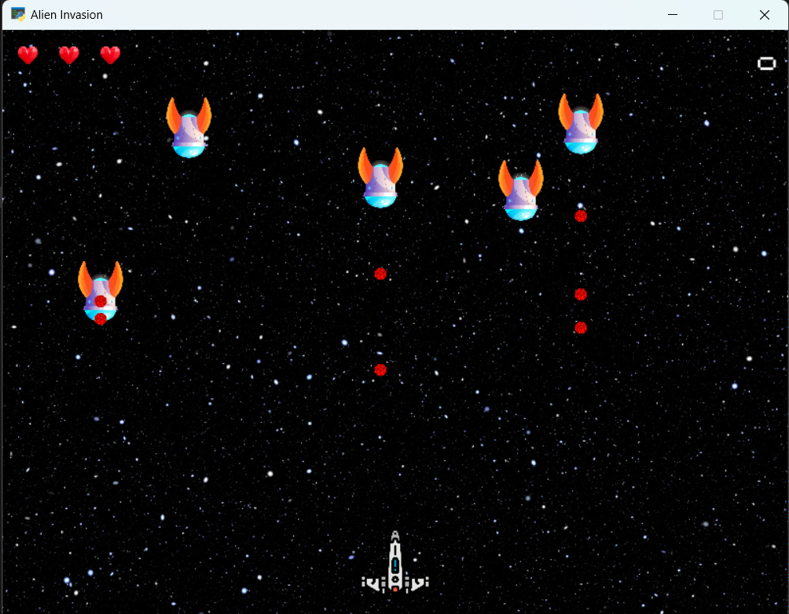
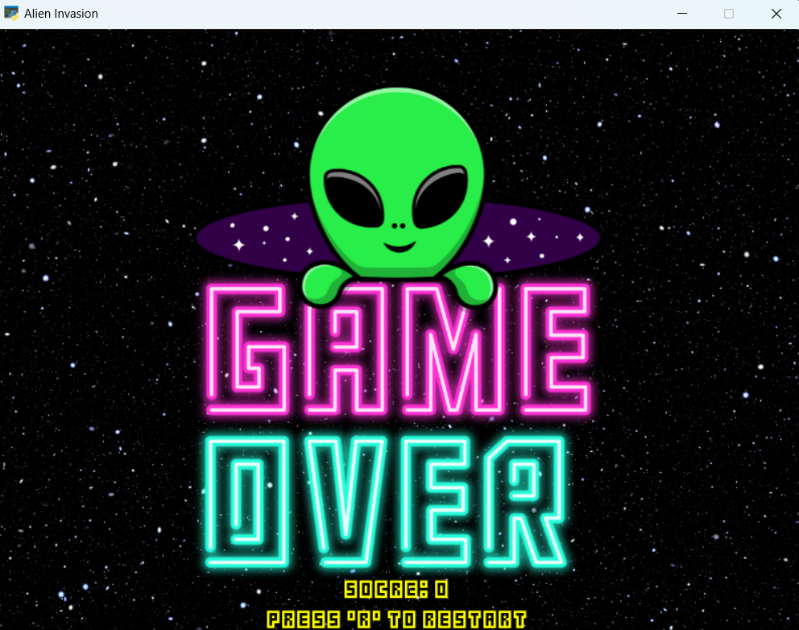

# Alien Invasion Game



🚀 Welcome to Alien Invasion! 🛸

Alien Invasion is an arcade-style game where you control a spaceship and defend Earth against invading alien forces. Your mission is to shoot down enemy spaceships, avoid enemy bullets, collect power-ups, and survive as long as possible.

## Game Instructions

👾 **Objective:** Destroy enemy spaceships and survive for as long as you can.

🎮 **Controls:**
- Use the **arrow keys** to move the spaceship.
- Press the **spacebar** to fire bullets.
Tip: Press and hold the space-bar to keep firing!

💥 **Gameplay:**
- Destroy enemy spaceships by shooting them with your bullets.
- Avoid enemy bullets to prevent losing a life.
- Collect power-ups to gain advantages:
  - **Extra Bullets:** Increases the number of bullets you can fire.
  - **Penetrating Bullets:** Allows your bullets to pass through multiple enemies.
  - **Life Power-up:** Adds an extra life to your spaceship.
  N.B. Extra Bullets and Penetrating Bullets are not available on this version of the game. Instead, this powerups increase the speed of the bullet currently. 
- The game ends when you lose all your lives.
- Your score increases by 10 for each enemy spaceship destroyed.
- The top score is displayed on the home screen.

## Screenshots






## Installation and Running the Game

1. Clone this repository to your local machine or download the source code as a ZIP file.
2. Ensure you have Python 3.x installed on your system.
3. Install the required dependencies by running the following command:
   ```
   pip install -r requirements.txt
   ```
4. Run the game by executing the following command:
   ```
   python main.py
   ```
5. Enjoy playing Alien Invasion!

## Dependencies

- Arcade: `arcade`

## Contributing

Contributions to Alien Invasion are welcome! If you find any issues or have suggestions for improvements, please feel free to open an issue or submit a pull request.

## License

This project is licensed under the [MIT License](LICENSE).

🎮 Have fun playing Alien Invasion! Save the Earth from the alien invasion! 🌍👽